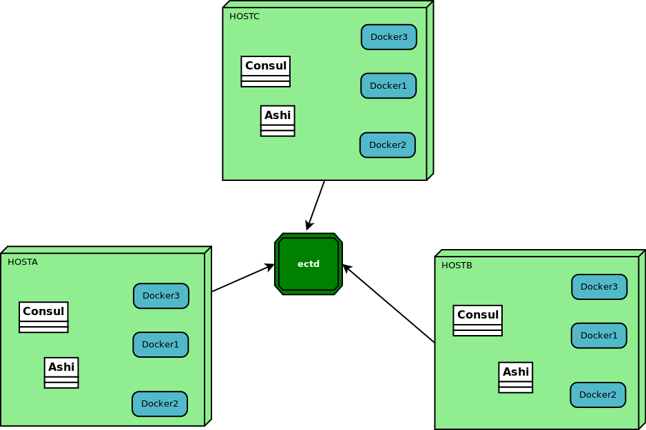
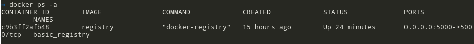

# Ashi

## Conpect

Every Docker host has own consul (server/client), but no one can help docker to update new docker container to consul services list. On the low level of Consul, It's using [ectd](https://github.com/coreos/etcd) to store shared information.

Docker-cli can know the status of each container, so ashi using Docker API to get the container info and update it into consul world.
